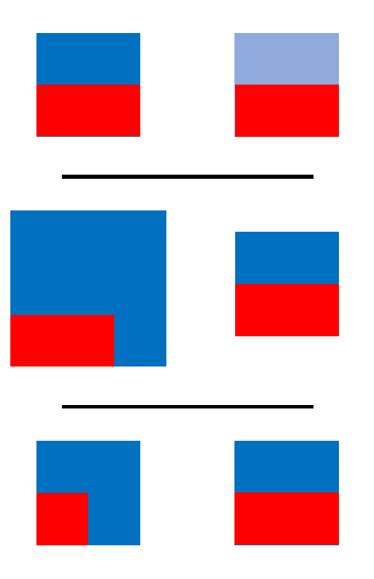

<a href = "https://www.dropbox.com/sh/hfgon5s13qin98b/AACmgu_uGrpWaAjWwJy9rnJRa?dl=0">

 [Link to Portfolio](https://www.dropbox.com/sh/hfgon5s13qin98b/AACmgu_uGrpWaAjWwJy9rnJRa?dl=0)

 [contact](seanywng@gmail.com)

# **Sean Ng**

### **Data Analysis in Humanitarian Settings**

I am a Disaster Management Expert and Data Analyst with a strong track record of advisory services, quality assurance and effective programme management in large-scale Emergency, Recovery and National Development Programmes. I have worked in emergencies in Sri Lanka, China, Japan, Thailand, Philippines, Nepal, Myanmar, Bangladesh and Venezuela. 

I have more than 10 years of expertise in (according to the approximate amount of time spent): 
Analytics & Research [19.2%]; Data Processing [18.5%]; Policy & Planning [18.4%]; Leadership & Capacity Building [17.9%]; Quality Assurance [16.8%]; and Coordination & Negotiation [9.2%].

I am a committed advocate of data transparency and inter-agency sharing in humanitarian and development settings. 

This site hosts some of my R projects, such as: 

 

#### [5W Cleaning and Reporting -- Education Cluster, Venezuela](https://seanywng.github.io/5W/)
 

#### [Coverage and Gaps Analysis -- Multi-Cluster, Venezuela](https://seanywng.github.io/coverage_gaps_venezuela/)

