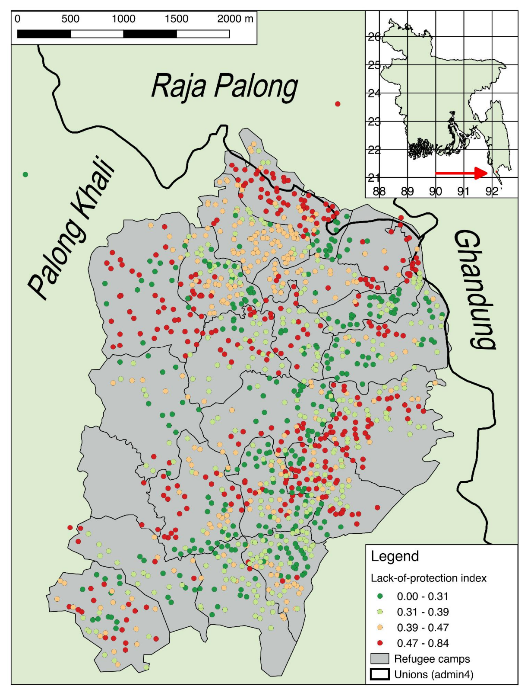
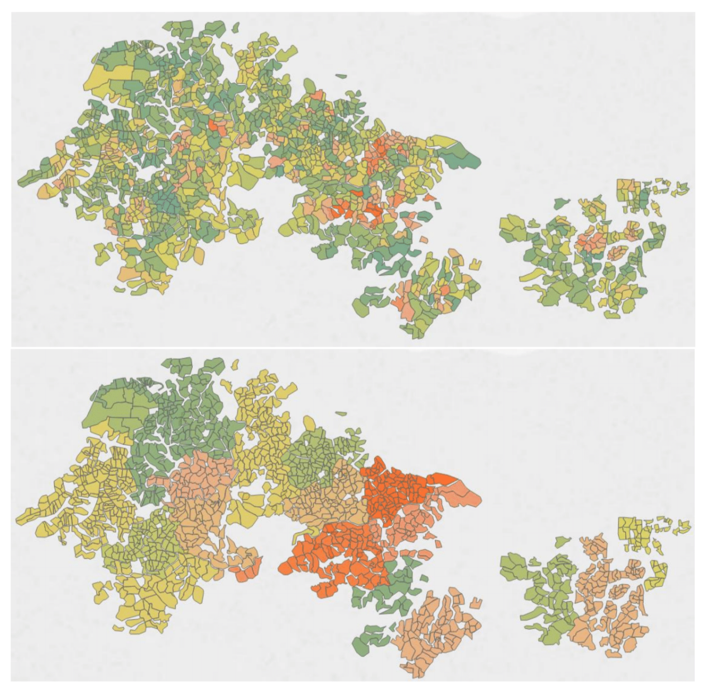

<a href = "https://github.com/seanywng">

&nbsp;&nbsp;&nbsp;&nbsp;&nbsp;&nbsp;&nbsp;&nbsp;[contact](mailto:seanywng@gmail.com)
&nbsp;&nbsp;&nbsp;&nbsp;&nbsp;&nbsp;&nbsp;&nbsp;&nbsp;&nbsp;&nbsp;&nbsp;&nbsp;[github](https://github.com/seanywng)

# **Sean Ng**

### **Analytics for Emergencies, Recovery and Risk Reduction**

 

Data analyst and disaster management expert. Armed conflict, complex emergencies and natural hazards.  

Sri Lanka, China, Japan, Thailand, Philippines, Nepal, Myanmar, Bangladesh, El Salvador, Venezuela and Syria.

This site hosts some of my projects, in reverse chronological order: 

   

### [Multi-sector Beneficiary Allocations and Cash-based Response](https://northwest-syria-cash-working-group.github.io/multisector_4Ws_review/#1) 
19 May 2023

{width=50%}

   

### [Township Prioritisation](https://food-security-cluster-myanmar.github.io/mmr_township_prioritisation/)
1 June 2022. 

{width=50%}

   

### [Understanding Conflict Dynamics in Myanmar through Conflict and Incident Data: A Food Security Perspective](https://food-security-cluster-myanmar.github.io/exploratory-data-analysis-acled-fsc/)
Updated 1 June 2022. 

{width=30%}

   

### [Report on the 2022/Q1 Food Security 5Ws](https://food-security-cluster-myanmar.github.io/fsc_5ws_first_quarter_2022/)
[PDF version](https://www.dropbox.com/s/ibswwmfhjpp9odh/fsc_2022_q1_5ws_report.pdf?dl=0)

{width=50%}

   

### [Coverage and Gaps Analysis -- Education, Health, Nutrition, Protection and WASH Clusters, Venezuela](https://seanywng.github.io/coverage_gaps_venezuela/)

{width=50%}

   

### [5W Cleaning and Reporting Script -- Education Cluster, Venezuela](https://seanywng.github.io/5W/)

{width=50%}

   

And some links to past work (only PDFs available): 

### [A New Index of Refugee Protection 2018 -- a discussion note with Aldo Benini](http://aldo-benini.org/Level2/HumanitData/Benini_Ng__A_New_Protection_Index__180806.pdf)

{width=50%}

   

### [Lessons Learnt on Assessments from the Rohingya Refugee Response 2018](https://www.dropbox.com/s/z859umvx6kmikm5/Lessons Learnt on Assessments 180525_SN.pdf?dl=0)

{width=50%}

   

### [Vulnerability in Myanmar 2017 -- Secondary Data Review, Countrywide](https://themimu.info/sites/themimu.info/files/documents/Report_Vulnerability_in_Myanmar_HARP-MIMU_Jun2018_ENG_Print_version.pdf)

{width=50%}

   

### [Myanmar National Recovery Framework and Plan -- Floods and Landslides 2015](https://www.dropbox.com/s/iv975x39hzz9cye/National Recovery Framework Final-2.pdf?dl=0)

{width=50%}

